<!-- you read the source. of course you did. -->
<p align="center">
  
</p>

```text
raj@github:~$ whoami
raj shrivastav

raj@github:~$ id
uid=1000(raj) gid=1000(learner) groups=1000(learner),10(security),
  20(ai-ml),30(backend),40(infra),99(civil-eng:legacy)

raj@github:~$ uname -a
Linux raj-learns 6.0-ropar #1 SMP PREEMPT_DYNAMIC btech-civil x86_64 GNU/Linux

raj@github:~$ ./status
┌─ SYSTEM STATUS ────────────────────────────────────────────┐
│ HOST     raj-learns                                        │
│ KERNEL   civil-eng, IIT Ropar (B.Tech), patched            │
│ DOMAIN   security × ai/ml × backend systems                │
│ FOCUS    DPDP · GRC · security automation                  │
│ MODE     learning / building / breaking (in staging)       │
│ UPTIME   questionable                                      │
│ COFFEE   optional                                          │
│ PROD     probably fine                                     │
│ STATE    ● ONLINE                                          │
└────────────────────────────────────────────────────────────┘
```

```text
raj@github:~$ man 7 raj-learns

RAJ-LEARNS(7)              Misc. Conventions Manual             RAJ-LEARNS(7)

NAME
       raj-learns - a process that builds things in order to understand them

SYNOPSIS
       raj-learns [--build] [--break] [--understand] [--repeat]

DESCRIPTION
       Does not trust an abstraction it has not opened at least once.
       Prefers the source to the summary of the source.
       Trained as a civil engineer: the habit of asking "how does this
       fail?" before "does this work?" carried over intact.

           understanding  >  memorizing
           building       >  watching
           breaking       >  assuming

OPTIONS
       --build        make it work
       --break        find out why it worked
       --understand   write down why it broke
       --repeat       default. cannot be disabled.

BUGS
       Reads the RFC instead of the tutorial.
       Says "it depends", then explains exactly what it depends on.

SEE ALSO
       nmap(1), prometheus(1), wazuh-agent(8), the-actual-source-code(7)
```

```text
raj@github:~$ tree -L 3 --dirsfirst ~/projects

~/projects
├── dpdp-grc/               # privacy & compliance infrastructure
│   ├── consent-registry/   # who agreed to what, provably
│   ├── compliance-engine/  # rules → checks → evidence
│   └── security-controls/  # controls mapped to real tooling
├── security-lab/           # break things on purpose, on hardware I own
│   ├── recon/              # nmap, enumeration
│   ├── vuln-assessment/    # zap · openvas/greenbone
│   └── monitoring/         # wazuh · alerts that mean something
├── infra/
│   ├── observability/      # prometheus → alertmanager → grafana
│   └── containers/         # docker, reproducible by default
├── ai-lab/
│   ├── computer-vision/    # opencv · tensorflow
│   ├── classical-ml/       # numpy · pandas · scikit-learn
│   └── experiments/        # things that did not generalize
└── notes/                  # TODO.md (never empty)

16 directories, 1 file
```

```text
raj@github:~$ ls /opt/stack          # ordered by distance from the metal

metal      C · C++ · Linux
runtime    Python · JavaScript
services   FastAPI · REST APIs · Docker
cloud      AWS · Google Cloud
signals    Prometheus · Alertmanager · Grafana
defense    Nmap · OWASP ZAP · OpenVAS/Greenbone · Wazuh
models     NumPy · Pandas · scikit-learn · TensorFlow · OpenCV
surface    React · HTML · CSS

raj@github:~$ cat /opt/stack/RULE
If I can't explain what's underneath it, it isn't in the stack.
It's on the to-learn list.
```

```text
raj@github:~$ nmap -sV raj-learns.local        # security lab, self-hosted

Host is up (0.00012s latency).

PORT       STATE     SERVICE       NOTES
1514/tcp   open      wazuh         alerts that mean something
3000/tcp   open      grafana       dashboards (the pretty part)
8080/tcp   open      zap-proxy     web app & REST API testing
9090/tcp   open      prometheus    metrics first, opinions later
9093/tcp   open      alertmanager  routing signal away from noise
9392/tcp   open      greenbone     vuln assessment, triaged not dumped
31337/tcp  filtered  elite         [REDACTED]

# every scan above ran against infrastructure I own. always.

raj@github:~$ python3 -q                       # ai/ml lab
>>> frame = cv2.imread("reality.jpg")
>>> model.fit(features, labels)                # "works on my dataset"
>>> model.score(train)                         # flattering
>>> model.score(unseen)                        # honest
```

```text
raj@github:~$ pstree -p 1                      # currently running

raj-learns(1)─┬─dpdp-grc         R  compliance & consent infrastructure
              ├─sec-automation   R  scan → triage → alert, automatically
              ├─observability    S  metrics, alerts, fewer 3am surprises
              ├─backend-core     R  FastAPI, REST, boring on purpose
              ├─cv-experiments   S  sleeping, not dead
              └─side-quests      Z  defunct, awaiting reap

# R running · S sleeping · Z zombie (we don't talk about the zombie)
```

```text
visitor@github:~$ sudo raj --collaborate
[sudo] password for visitor: ********
visitor is not in the sudoers file. This incident will be reported.
(kidding. say hi.)

visitor@github:~$ finger raj
Login: raj                              Name: Raj Shrivastav
Directory: /home/raj                    Shell: /bin/bash
Last login: still here
No mail.
Plan:
  Build security and compliance systems that hold up when assumptions fail.
  Open to: interesting problems, code review, being proven wrong (with evidence).
```

&nbsp;&nbsp;▸ [github.com/raj-learns](https://github.com/raj-learns)
<!-- ▸ [linkedin](https://www.linkedin.com/in/YOUR-HANDLE) · [mail](mailto:YOU@EXAMPLE.COM)  <- uncomment & fill in -->

<p align="center">
  
</p>
