<!-- you read the source. of course you did. -->

  

  

  

  

  

  

  

  

<b>▸ <a href="https://github.com/raj-learns">github.com/raj-learns</a></b>

<!-- 
<a href="https://www.linkedin.com/in/YOUR-HANDLE">linkedin</a> · <a href="mailto:YOU@EXAMPLE.COM">mail</a>
  <- uncomment & fill in -->

  

